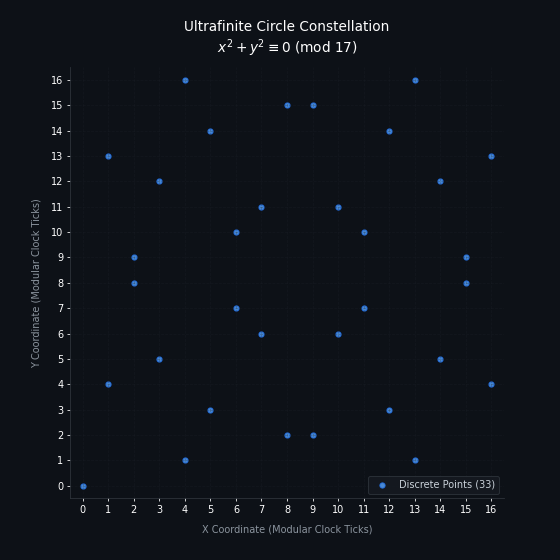
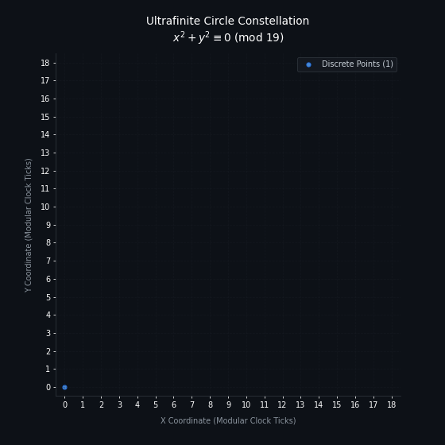
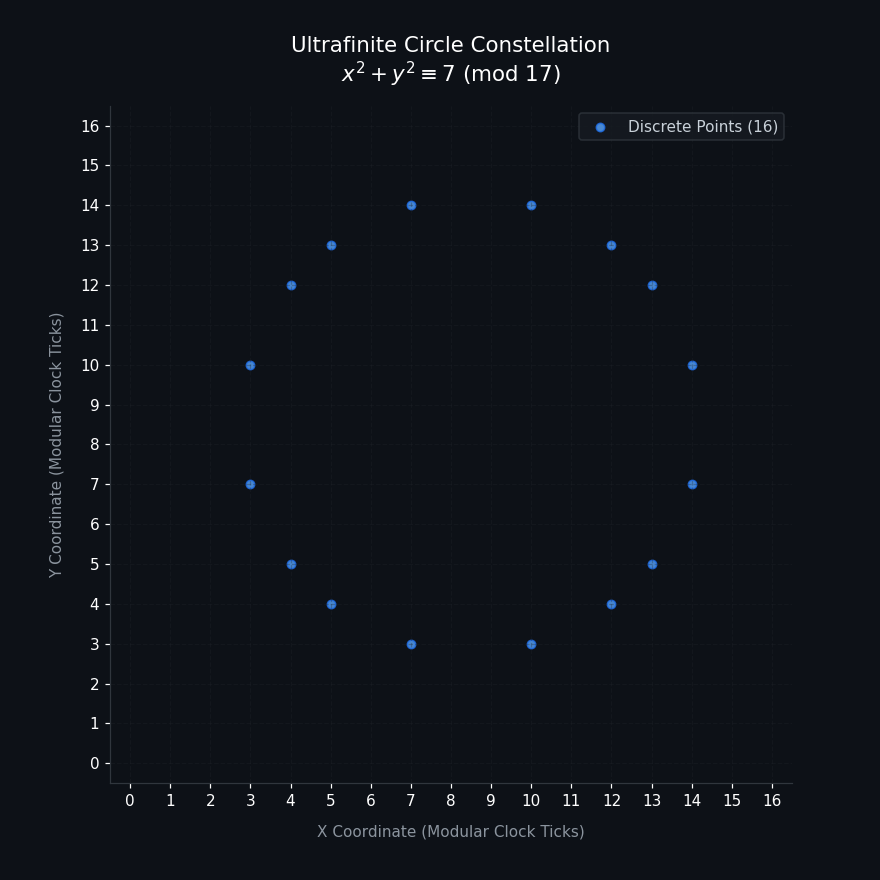
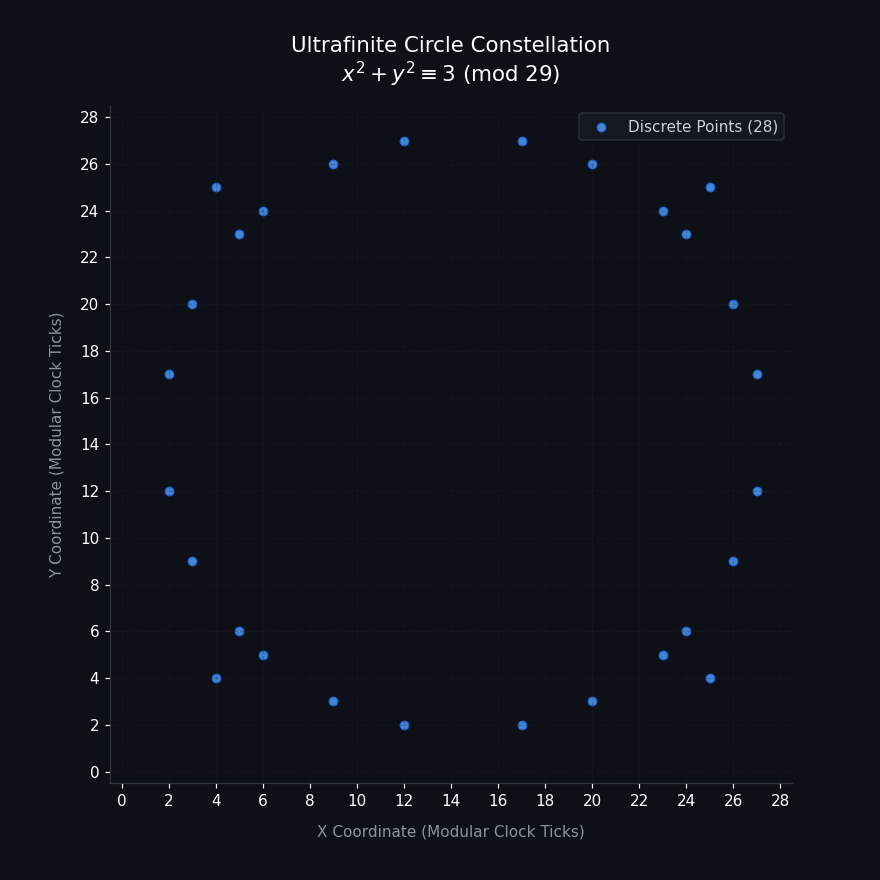
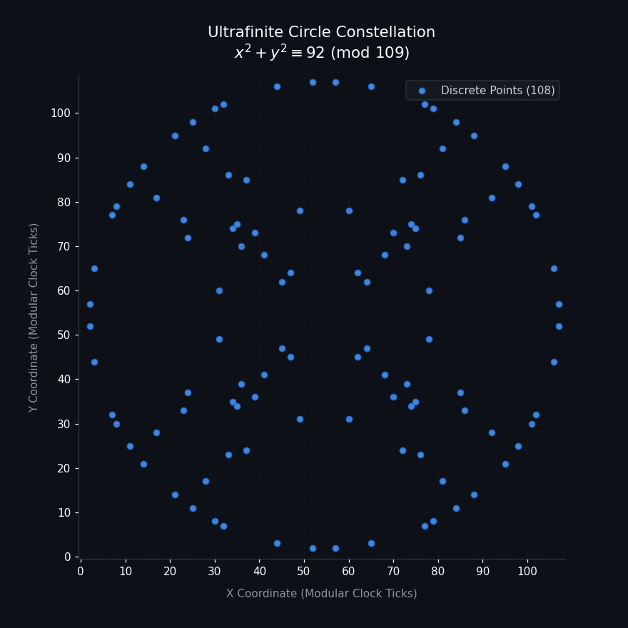
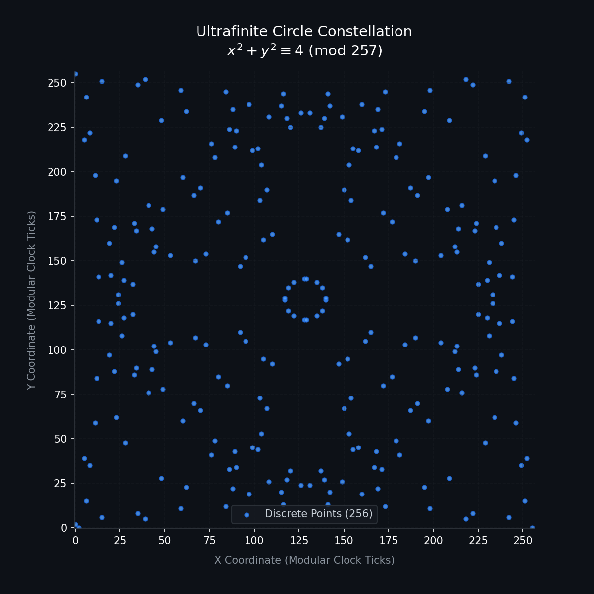
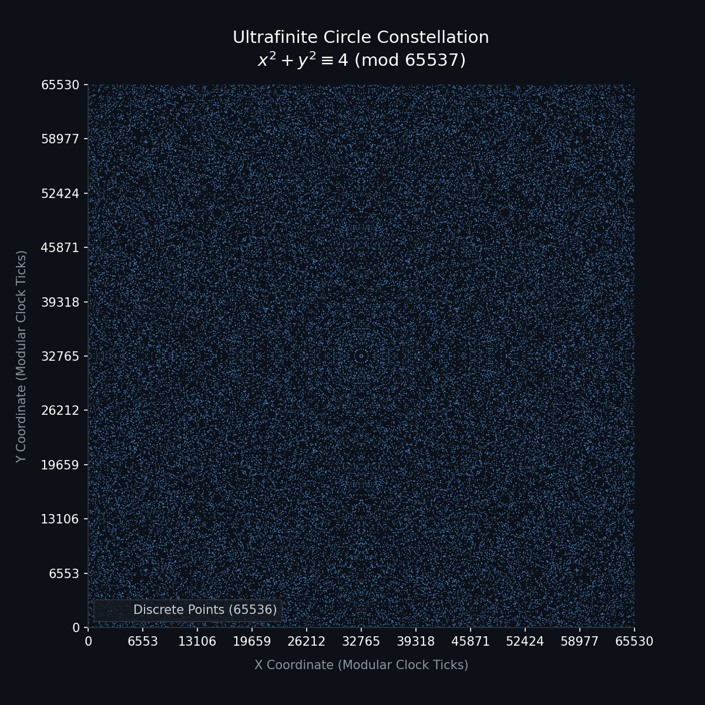

# Honors Algebra, Period 3 — Day One: Circles

**Cast**
**Mrs. Feeney**, who has taught the Ultimate Ceiling curriculum for nineteen years.
**Ralphie**, front row, who has read ahead and is confident about it.
**Popovich**, back row, whose grandfather wrote forty pages about something called `ℝ`
and was invited to spend eleven years thinking it over in a facility near the mountains.

*(All arithmetic in this transcript has been checked. Ralphie's has not.)*

---

**MRS. FEENEY:** Hello, students! Welcome to Honors Algebra. Settle in, find a seat —
Popovich, an actual seat, thank you.

Today: circles.

Everyone has drawn a circle. Today you learn what a circle *is*, which is a different
thing and a better one. On our grid, a circle is every pair `(x, y)` satisfying

```
x² + y² ≡ c   (mod p)
```

That's the whole definition. Now — the question I want from you is not "what does it look
like." It's *"how many points, and what holds them together?"* Both have exact answers.

**RALPHIE:** Mrs. Feeney! Mrs. Feeney. Should we start with how the circle *disappears*
if you pick a bad prime? Like 19? Because 19 leaves a remainder of 3 when you divide by
4, so the circle collapses entirely —

**MRS. FEENEY:** No, Ralphie.

**RALPHIE:** — and that's why we only use good primes like 17, because — sorry. No?

**MRS. FEENEY:** No. Where did you read that?

**RALPHIE:** ...A tutoring service.

**MRS. FEENEY:** Get your money back. Let's count. Everyone take `c = 4`. Count the
points on the 17-clock, and then on the 19-clock. Popovich, you may use your tablet, I
know you were going to anyway.

**POPOVICH:** *(not looking up)* Sixteen and twenty.

**MRS. FEENEY:** Sixteen and twenty. Ralphie, 19 is the prime you said had *no* circle.
It has four more points than 17 does. Here is the actual law, and I want it in your notes:

| | number of points, `c ≠ 0` |
|---|---|
| `p ≡ 1 (mod 4)` | **`p − 1`** |
| `p ≡ 3 (mod 4)` | **`p + 1`** |

**RALPHIE:** So the bad primes are... better?

**MRS. FEENEY:** There are no bad primes. There's a law, and it goes one way for half of
them and the other way for the rest. That's not a defect, Ralphie, that's the *whole
subject.*

---

## Where it really does collapse

**MRS. FEENEY:** Now — Ralphie wasn't hallucinating entirely. Something does collapse.
He just had it pinned to the wrong knob. Set `c = 0`. Radius zero.

**RALPHIE:** *(fast)* One point! The origin! Zero squared plus zero squared —

**MRS. FEENEY:** On the 19-clock, yes. Exactly one lonely point. On the 17-clock?

**POPOVICH:** Thirty-three.

**RALPHIE:** *Thirty-three?* For radius **zero**?

**POPOVICH:** It's two lines. They cross at the origin. `2p − 1`, you're double-counting
where they meet.

| `c = 0` on the 17-clock | `c = 0` on the 19-clock |
|---|---|
|  |  |

**MRS. FEENEY:** *(delighted)* Two lines, crossing at the origin. A circle of radius zero
that is secretly a large `X`. Popovich, that is the correct answer and you clearly did it
before I asked the question.

**POPOVICH:** I got bored.

**MRS. FEENEY:** Get bored more. — *That*, class, is where `p mod 4` earns its
reputation. Not on `c = 4`. On `c = 0`.

---

## The good part

**MRS. FEENEY:** Now I'll tell you *why* the count works, and this is the part I have
been looking forward to since August.

Last unit you learned that on some clocks there is a real, honest number that squares to
`−1`. On the 17-clock, what is it?

**RALPHIE:** Four! Four squared is sixteen, and sixteen is `−1` on a 17-clock.

**MRS. FEENEY:** Good. Now watch. With that number in hand:

```
x² + y²  =  (x + 4y)(x − 4y)      on the 17-clock
```

Check it at every one of the 289 grid points if you like. It holds at all of them.

**RALPHIE:** That's just... difference of squares. That's from *seventh grade.*

**MRS. FEENEY:** It is exactly difference of squares. Seventh grade comes back for you.
Now substitute `u = x + 4y` and `v = x − 4y`, and the circle equation becomes:

```
u · v = c
```

Count *that*. How many ways?

**POPOVICH:** *(sitting up slightly)* Pick `u` to be anything nonzero, `v` is forced.
Sixteen choices. Sixteen points.

**MRS. FEENEY:** `p − 1`. And you didn't memorize it, you *derived* it in one line.

**RALPHIE:** So the square roots of `−1` and the circle count are —

**MRS. FEENEY:** The same fact. They were never two lessons. The factoring works exactly
when `−1` is a square, and that is exactly when `p ≡ 1 (mod 4)`. Gold star, Ralphie,
that's the sentence I wanted.

**RALPHIE:** *(beaming)*

**POPOVICH:** So what happens on 19, where your `i` doesn't exist?

**MRS. FEENEY:** Ah.

**POPOVICH:** Because you still got twenty points. You said so. The circle didn't care
that the number was missing.

**MRS. FEENEY:** Then we build it.

**POPOVICH:** You *build* it.

**MRS. FEENEY:** We adjoin `i`. We declare a new symbol whose square is `−1`, we attach
it to the 19-clock, and we obtain a perfectly good field of 361 numbers. In it, `x² + y²`
is the norm of `x + iy`. The norm map lands `(p² − 1)/(p − 1) = p + 1` numbers on every
target. Twenty points. Same as we counted.

**POPOVICH:** Mrs. Feeney.

**MRS. FEENEY:** Yes, Popovich.

**POPOVICH:** You took a field where a square root was missing, and you invented a new
number to fill the hole, and you got a field twice as big where every rotation lives.

**MRS. FEENEY:** ...Yes.

**POPOVICH:** My grandfather went to the mountains for eleven years for writing down that
exact sentence.

*(The room gets quiet. Ralphie looks at his desk.)*

**MRS. FEENEY:** *(after a moment, putting down the marker)* Your grandfather was a better
mathematician than the people who sent him there.

I'm not going to stand here and tell you this is different. It isn't. `F_p[i]` is the
finite mirror of the thing his forty pages were about. Every argument I just made is an
argument he'd recognize. The difference between what we do and what he did is that ours
stops — the mirror has `p²` numbers in it and you can count them — and his didn't. That
is a real difference. It is not the difference the textbook claims, which is that we
never needed the idea at all.

We need the idea. We use it in the second week. The chapter heading that says otherwise
is wrong, and you may write that in the margin.

**POPOVICH:** *(a beat)* ...I'll write it in the margin.

**MRS. FEENEY:** Do. In pen.

---

## The circle is a rotation group. Actually. Not by analogy.

**MRS. FEENEY:** Recover, everyone, because the next part is the best thing you'll see
this year. Take two points on the circle `x² + y² = 1` and multiply them like this:

```
(a, b) ⋆ (u, v)  =  (au − bv,  av + bu)
```

Try it. Take any two points on the circle, combine them, see where you land.

**RALPHIE:** ...I landed back on the circle.

**MRS. FEENEY:** Try again.

**RALPHIE:** Still on the circle. *(pause)* Mrs. Feeney, I can't get off the circle.

**MRS. FEENEY:** You can't get off the circle. It's closed. The circle is a **group**.
And it's better than that. Popovich — take the 17-clock, take the point `(4, 6)`, and
keep multiplying it by itself. Tell me what you see.

**POPOVICH:** *(a minute of tapping)* It hits every point on the circle. All sixteen. Then
it comes back to `(1, 0)` and starts over.

**MRS. FEENEY:** Every point, exactly once, then home. That is a **generator**. There is a
smallest rotation on our finite circle — one sixteenth of the way around — and every
rotation is a repeat of it.

| clock | circle size | a generator |
|---|---|---|
| 7 | 8 | (2, 2) |
| 17 | 16 | (4, 6) |
| 19 | 20 | (3, 7) |
| 29 | 28 | (5, 11) |
| 103 | 104 | (2, 10) |

| 17-clock, `c = 7` — 100% on one ring | 29-clock, `c = 3` — 24 of 28 |
|---|---|
|  |  |

**RALPHIE:** So *this* is how the engineers rotate things! Not the swap-and-flip trick you
showed us for 90 degrees!

**MRS. FEENEY:** The swap-and-flip *is* this. It's this one specific element. I showed you
a single brick and called it architecture. Here's the building.

**POPOVICH:** Does the generator go around in order?

**MRS. FEENEY:** Say more.

**POPOVICH:** When you keep multiplying — does the point walk around the picture like a
clock hand? Neighbor to neighbor?

**MRS. FEENEY:** *(pause)* No. It jumps all over the picture.

**POPOVICH:** Then in what sense is it a rotation?

**MRS. FEENEY:** In the sense that it generates the group. Not in the sense that it moves
a little bit at a time — that would require knowing what "a little bit" means, and we're
about to discuss why we don't. Popovich, that question is your homework, and I mean that
as a compliment. Nobody has asked me that in four years.

---

## What we don't have

**MRS. FEENEY:** Which brings us to the uncomfortable slide. Some of what a circle means
in the old texts, we simply do not have. Not "cleverly avoid." Do not have.

- **No distance.** Our clock has no ordering. You cannot ask whether one point is farther
  out than another. "Radius squared" is a label on an equation, not a length.
- **No angle. No arc. No pi.** Not a triumph over pi. There is no arc to measure, so there
  is nothing for pi to be the ratio *of*.
- **No betweenness.** No point lies between two others. Our circle is not a curve. It
  never was.

**RALPHIE:** But the textbook says the absence of pi is why our bridges don't have
rounding errors —

**MRS. FEENEY:** The textbook is selling something. If you delete the concept of length,
of course you have no errors in measuring length. You also have no bridges.

What survives is the count, the group, the symmetry, the factoring. That is a great deal!
It is simply algebra rather than geometry, and I would rather you knew which one you were
holding.

---

## The pictures, which are the least interesting part

**RALPHIE:** *(rallying)* But when you scale up to ten thousand ticks, the points get so
dense that they blur into a smooth ring! That's the Human Threshold!

**MRS. FEENEY:** Popovich, plot the 65537-clock.

**POPOVICH:** *(after a moment, turning the tablet around)* It's dust. It's a grey
rectangle of dust.

| p = 29 | p = 109 | p = 257 | p = 65537 |
|---|---|---|---|
|  |  |  |  |

*The dissolve. Structure lives at small primes.*

**RALPHIE:** That can't be right —

**MRS. FEENEY:** It's right. And it's backwards from what you were told, so hear it
clearly: **the points spread out evenly.** About `p` points scattered over `p²` cells, so
they thin out as the clock grows. Big primes don't sharpen into a ring. They dissolve.

The beautiful pictures are at *small* primes:

| clock, `c` | share of points on one ring |
|---|---|
| 17, 7 | **100%** |
| 29, 3 | 86% — twenty-four of twenty-eight, and it *looks* like a circle |
| 53, 49 | 62% |
| 109, 92 | 44% |

Every residue of every prime under 600 was checked. Past about 150, nothing beats 40%.

**POPOVICH:** Why does *any* of it ring up, then? If they're spread evenly.

**MRS. FEENEY:** *(genuinely pleased)* Because sometimes there's no wraparound. If
`x² + y²` equals `c + kp` as an *honest whole number* — no clock involved — those points
sit on a real circle of real integers. Our modular circle is a stack of ordinary integer
circles, and one of them dominates when `c + kp` happens to be a number with many ways of
being written as a sum of two squares.

For the 29-clock at `c = 3`, that number is `650 = 2 · 5² · 13`. It has twenty-four such
ways. Twenty-four points, one ring.

**POPOVICH:** So the nicest thing our finite grid does is accidentally show us a picture
of ordinary integers.

**MRS. FEENEY:** *(long pause)* Yes.

**POPOVICH:** Huh.

---

## The bell

**MRS. FEENEY:** Two minutes. Ralphie, you had your hand up for six of them.

**RALPHIE:** I just wanted to say — on the first slide you said the reason we do all this
is that no fraction squares to 2. And that our clocks find the exact number that does.

**MRS. FEENEY:** I did say that.

**RALPHIE:** So I checked, because I wanted to have it ready for you. And on the 5-clock
there's no square root of 2. There isn't one on the 13-clock either. Or the 29-clock.
Those are three of the four clocks in the chapter.

*(Popovich starts laughing.)*

**MRS. FEENEY:** *(setting down the marker)* Ralphie. That is the best question anyone has
asked today, and you asked it by accident while trying to agree with me.

You're right. `√2` exists on a clock exactly when `p ≡ ±1 (mod 8)`. It's there on 7, 17,
23, 31, 41. It is *not* there on 5, 13, or 29. The example the entire curriculum opens
with does not work on most of the clocks the curriculum teaches.

**RALPHIE:** So what do we do on the 13-clock?

**MRS. FEENEY:** We extend the field.

**POPOVICH:** *(still laughing)* You build it again.

**MRS. FEENEY:** We build it again. Yes. That is the second thing you may write in the
margin.

*(bell)*

**MRS. FEENEY:** Homework — and put your tablets down, this is the whole assignment:

> **One.** Count the points for `c = 0` on the 17-clock and the 19-clock. Explain the
> thirty-three.
> **Two.** Find a generator for the 13-clock circle. Any generator.
> **Three.** Popovich's question. When you step a generator around the circle, the point
> hops all over the picture instead of walking neighbor to neighbor. Why? I don't want a
> paragraph. I want one honest sentence about what "neighbor" would even mean here.

Nobody has turned in a good answer to number three since I started assigning it. I'd like
that to change this year.

Popovich — a moment.

**POPOVICH:** *(gathering his bag)* I know, I know, the seat —

**MRS. FEENEY:** No. Your grandfather's forty pages. Are they somewhere I could read them?

*(Popovich stops in the doorway.)*

**POPOVICH:** ...I'd have to ask my mother.

**MRS. FEENEY:** Ask her. Chapter 4 is about extensions, and I've never had anything good
to hand the students who get that far.

---

### For the teacher's edition

Verified in this transcript: point counts `p ∓ 1`; the `c = 0` split (33 vs. 1); the
factorization `x² + y² = (x + iy)(x − iy)` at all `p²` grid points for `p = 13, 17, 29`;
closure and cyclicity of the group law `(a,b) ⋆ (u,v) = (au − bv, av + bu)` with the
generators tabled above; ring fractions from an exhaustive search over every residue of
every prime below 600; `√2` existing exactly when `p ≡ ±1 (mod 8)`.

Ralphie's errors are quoted from a real lesson transcript. Every one of them was
presented there as fact.
